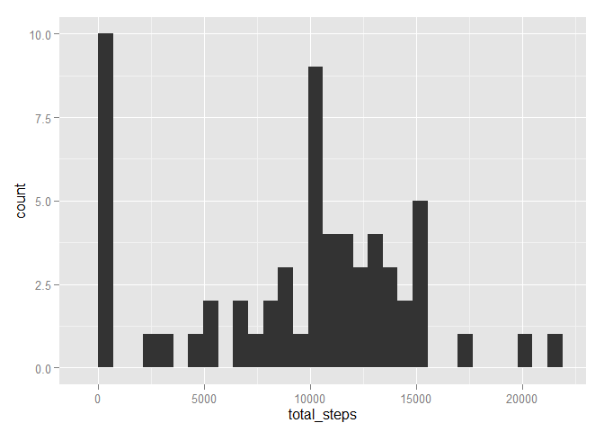
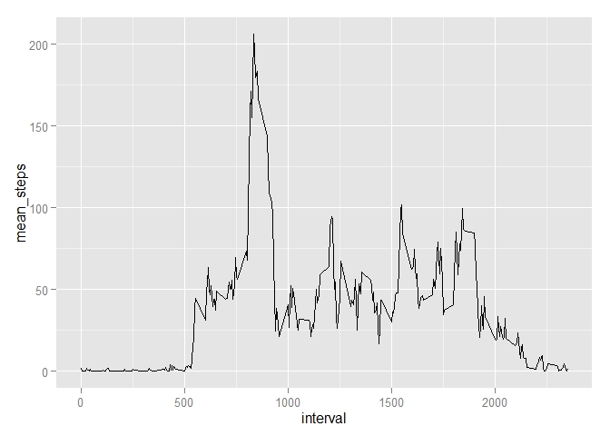
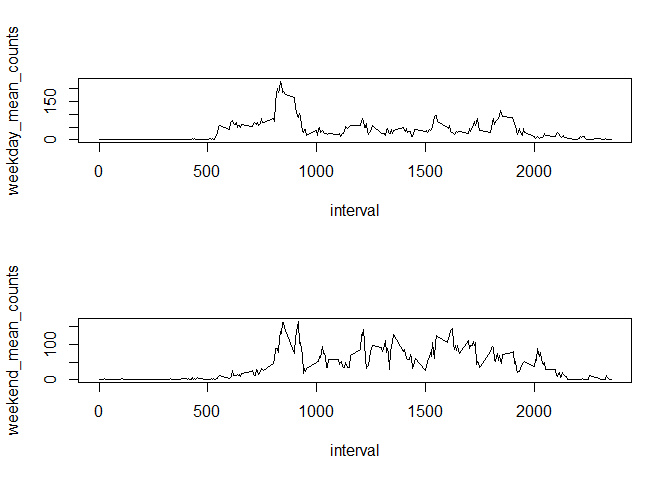

# Reproducible Research: Peer Assessment 1


## 1. Loading and pre-processing the data


```r
activity <- read.csv('activity.csv',header=TRUE)
str(activity)
```

```
## 'data.frame':	17568 obs. of  3 variables:
##  $ steps   : int  NA NA NA NA NA NA NA NA NA NA ...
##  $ date    : Factor w/ 61 levels "2012-10-01","2012-10-02",..: 1 1 1 1 1 1 1 1 1 1 ...
##  $ interval: int  0 5 10 15 20 25 30 35 40 45 ...
```


## 2. What is the mean total number of steps taken per day?

### Total number of steps taken per day and its histogram


```r
library(ggplot2)
```

```
## Warning: package 'ggplot2' was built under R version 3.1.3
```

```r
total_steps_list_vec <- as.vector(tapply(activity$steps,activity$date,sum,na.rm=TRUE))
total_steps_df <- data.frame(date = unique(activity$date),total_steps=total_steps_list_vec)
ggplot(total_steps_df,aes(x=total_steps))+geom_histogram()
```

```
## stat_bin: binwidth defaulted to range/30. Use 'binwidth = x' to adjust this.
```

 

### Mean number of steps taken per day


```r
mean_steps_list <- as.vector(tapply(activity$steps,activity$date,mean,na.rm=TRUE))
mean_steps_df <- data.frame(date=unique(activity$date),mean_steps = mean_steps_list)
head(mean_steps_df)
```

```
##         date mean_steps
## 1 2012-10-01        NaN
## 2 2012-10-02    0.43750
## 3 2012-10-03   39.41667
## 4 2012-10-04   42.06944
## 5 2012-10-05   46.15972
## 6 2012-10-06   53.54167
```

### Median number of steps taken per day


```r
median_steps_list <- as.vector(tapply(activity$steps,activity$date,median,na.rm=TRUE))
median_steps_df <- data.frame(date=unique(activity$date),median_steps = median_steps_list)
head(median_steps_df)
```

```
##         date median_steps
## 1 2012-10-01           NA
## 2 2012-10-02            0
## 3 2012-10-03            0
## 4 2012-10-04            0
## 5 2012-10-05            0
## 6 2012-10-06            0
```

## What is the average daily activity pattern?


```r
library(ggplot2)
mean_steps_per_interval <- round(as.vector(tapply(activity$steps,activity$interval,mean,na.rm=TRUE)),3)
mean_steps_per_interval_df <-  data.frame(interval=unique(activity$interval),mean_steps=mean_steps_per_interval)
ggplot(mean_steps_per_interval_df,aes(interval,mean_steps))+geom_line()
```

 

### 5 minute interval that has max number of steps on an average


```r
max_step_index <- which(mean_steps_per_interval_df$mean_steps==max(mean_steps_per_interval_df$mean_steps))
print (mean_steps_per_interval_df[max_step_index,])
```

```
##     interval mean_steps
## 104      835     206.17
```

## Imputing missing values

### Total number of missing values in the dataset (rows which have NA)

```r
print (sum(is.na(activity$steps)))
```

```
## [1] 2304
```

### Filling the missing values in the data set and creating a new data set

```r
library(data.table)
```

```
## Warning: package 'data.table' was built under R version 3.1.3
```

```r
# splits the data set according to the levels of the interval
activity_interval <- split(activity,activity$interval)
# 
for (length_index in seq(length(activity_interval))){
        na_index <- which(is.na(activity_interval[[length_index]]$steps))
        if (length(na_index) > 0){
                activity_interval[[length_index]][na_index,'steps']=mean(activity_interval[[length_index]]$steps,na.rm=TRUE)
        }        
}
new_activity <- rbindlist(activity_interval)
# no NA values in the resulting data frame
print (sum(is.na(new_activity$steps)))
```

```
## [1] 0
```

### Histogram of total number of steps each day


```r
library(ggplot2)
total_steps_list_vec_new <- as.vector(tapply(new_activity$steps,new_activity$date,sum,na.rm=TRUE))
total_steps_df_new <- data.frame(date = unique(new_activity$date),total_steps=total_steps_list_vec_new)
ggplot(total_steps_df_new,aes(x=total_steps))+geom_histogram()
```

```
## stat_bin: binwidth defaulted to range/30. Use 'binwidth = x' to adjust this.
```

 

### Mean of total number of steps taken each day

```r
mean_steps_list_new <- as.vector(tapply(new_activity$steps,new_activity$date,mean,na.rm=TRUE))
mean_steps_df_new <- data.frame(date=unique(new_activity$date),mean_steps = mean_steps_list_new)
head(mean_steps_df_new)
```

```
##         date mean_steps
## 1 2012-10-01   37.38260
## 2 2012-10-02    0.43750
## 3 2012-10-03   39.41667
## 4 2012-10-04   42.06944
## 5 2012-10-05   46.15972
## 6 2012-10-06   53.54167
```


### Median of totla number of steps taken each day


```r
median_steps_list_new <- as.vector(tapply(new_activity$steps,new_activity$date,median,na.rm=TRUE))
median_steps_df_new <- data.frame(date=unique(new_activity$date),median_steps = median_steps_list_new)
head(median_steps_df_new)
```

```
##         date median_steps
## 1 2012-10-01     34.11321
## 2 2012-10-02      0.00000
## 3 2012-10-03      0.00000
## 4 2012-10-04      0.00000
## 5 2012-10-05      0.00000
## 6 2012-10-06      0.00000
```

## Are there differences in activity patterns between weekdays and weekends?

### Creating a new factor variable with weekdays and weekend

```r
# whatDay is a new factor vector
whatDay <- c()

for (index in seq(nrow(new_activity))){
        if (weekdays(as.Date(new_activity$date[[index]]))=='Saturday' | weekdays(as.Date(new_activity$date[[index]]))=='Sunday'){
                whatDay <- c(whatDay,'weekend')
        }
        else{
                whatDay <- c(whatDay,'weekday')
        }
}

new_activity$day_type <- whatDay
```

### Making a panel plot


```r
# new data set devoid of NA is split according to weekdays and weekends
new_activity_day_type <- split(new_activity,new_activity$day_type)

# for each data set mean is calculated
mean_steps_per_interval_new_activity_day_type1 <- round(as.vector(tapply(new_activity_day_type[[1]]$steps,new_activity_day_type[[1]]$interval,mean,na.rm=TRUE)),3)
mean_steps_per_interval_df1 <-  data.frame(interval=unique(new_activity_day_type[[1]]$interval),mean_steps=mean_steps_per_interval_new_activity_day_type1)

mean_steps_per_interval_new_activity_day_type2 <- round(as.vector(tapply(new_activity_day_type[[2]]$steps,new_activity_day_type[[2]]$interval,mean,na.rm=TRUE)),3)
mean_steps_per_interval_df2 <-  data.frame(interval=unique(new_activity_day_type[[2]]$interval),mean_steps=mean_steps_per_interval_new_activity_day_type2)

par(mfrow=c(2,1))
with(mean_steps_per_interval_df1,plot(interval,mean_steps,type='l',ylab='weekday_mean_counts'))
with(mean_steps_per_interval_df2,plot(interval,mean_steps,type='l',ylab='weekend_mean_counts'))
```

 
